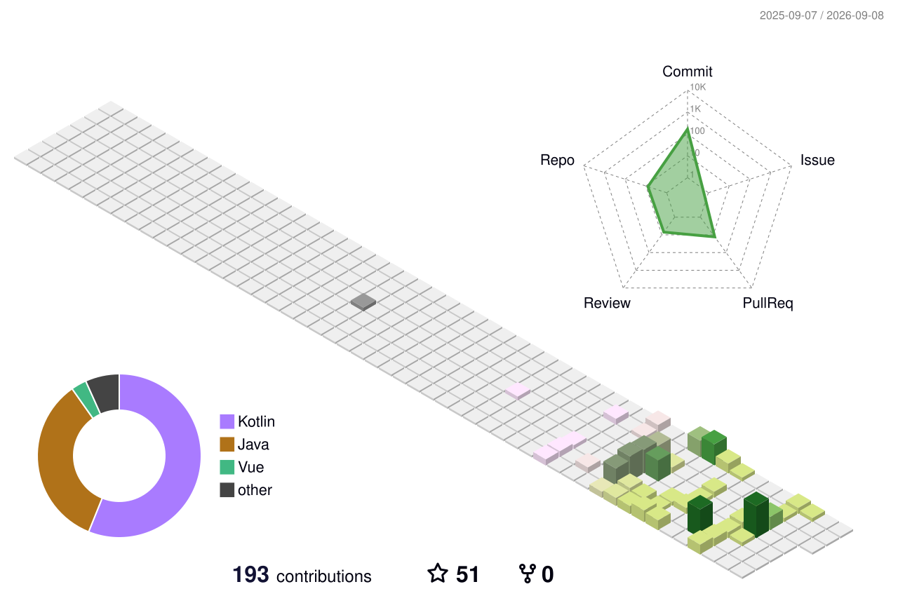

  

  JAVA | AI Full-Stack

## Contribution Graph

  

### Top Languages

  

## Tech Stack

<table>
  <tr>
    <td align="right"><b>Languages</b></td>
    <td>
      
      
      
    </td>
  </tr>
  <tr>
    <td align="right"><b>Java Stack</b></td>
    <td>
      
      
      
      
    </td>
  </tr>
  <tr>
    <td align="right"><b>Python Stack</b></td>
    <td>
      
      
      
    </td>
  </tr>
  <tr>
    <td align="right"><b>Databases</b></td>
    <td>
      
      
      
      
    </td>
  </tr>
  <tr>
    <td align="right"><b>DevOps & Tools</b></td>
    <td>
      
      
      
    </td>
  </tr>
  <tr>
    <td align="right"><b>AI Coding Tools</b></td>
    <td>
      
      
      
    </td>
  </tr>
</table>

